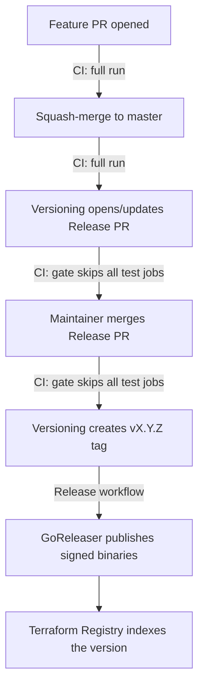

# CI and release pipeline

Human-oriented map of how a change travels from a pull request to a published
release, and why the pipeline skips work it doesn't need. For the
release/registry runbook see [RELEASE.md](RELEASE.md); for the compliance
gates a PR is judged against see
[SECURITY_COMPLIANCE.md](SECURITY_COMPLIANCE.md); this document covers the CI
mechanics.

## Workflows at a glance

| Workflow | File | Trigger | Purpose |
|---|---|---|---|
| CI | `.github/workflows/ci.yml` | PR, push to `master`, manual | Lint/unit/mock-acceptance (`check`), registry docs (`docs`), Trivy + govulncheck gates, security summary, fork-facing mock matrix, and the live sandbox acceptance suite on a self-hosted EC2 runner |
| Versioning | `.github/workflows/versioning.yml` | After every CI run on `master` (`workflow_run`), manual | release-please: opens/updates the Release PR; creates the `vX.Y.Z` tag when it merges |
| Release | `.github/workflows/release.yml` | Push of a `v*` tag | GoReleaser: builds, GPG-signs, attests and publishes binaries + release SBOM |
| PR Title Check | `.github/workflows/pr-title.yml` | PR | Enforces Conventional Commit PR titles (they become the squash-commit subjects release-please reads) |
| Cleanup EC2 runners | `.github/workflows/cleanup-ec2-runners.yml` | Cron (30-min leak reaper), manual | Terminates EC2 runner instances leaked by crashed/cancelled runs |

Checks that live outside these workflows: CodeQL (GitHub default setup), the
DCO bot, and the `security/snyk (Namecheap)` integration.

## Life of a change

A single code change used to run the full pipeline **four** times on its way
to a release (PR, merge, Release PR, Release PR merge). The `changes` gate in
`ci.yml` cuts that to the two runs that test something new — the Release PR
only touches `CHANGELOG.md` and `.release-please-manifest.json`, so re-testing
the already-merged code there added no signal. In this repository the waste is
not just hosted-runner minutes: each gated-away run also skips a start/stop
cycle of the **self-hosted EC2 sandbox runner** (`t3.medium` + the whitelisted
Elastic IP), so the gate saves real AWS cost per release, and removes two trips
through the single-EIP acceptance queue that other runs would otherwise wait
behind.

## The changes gate

The first job in CI, `changes` (check name "Detect Changes"), uses
[dorny/paths-filter](https://github.com/dorny/paths-filter) to classify the
diff, and the other jobs skip themselves via `needs: changes` plus an `if:`
condition on its `code` output. `code` is false **only** when the diff touches
nothing but root-level markdown (`README.md`, `CHANGELOG.md`, `CLAUDE.md`,
...), `LICENSE`, or `.release-please-manifest.json`. Everything else —
including `docs/**`, `templates/**` and `examples/**` — counts as code:
`docs/` is published to the Terraform Registry at each release tag and is
user-visible, so doc changes get the full pipeline like any other change
(see [CLAUDE.md](CLAUDE.md) for the matching `fix(docs):` commit convention
that makes such corrections actually release).

`workflow_dispatch` runs bypass the filter and always count as code: manual
dispatch is a maintainer explicitly asking for a run — it is the documented
path for live acceptance on Dependabot branches — and there is no diff to
classify anyway.

What runs when (rows are change kinds, columns are jobs; the pre-existing
fork/Dependabot/event conditions still apply on top of the gate):

| Change | Check / Docs / Trivy / govulncheck / summary | Mock acceptance matrix | EC2 start → acceptance → stop | CI OK |
|---|---|---|---|---|
| Code, workflows, `docs/**`, `templates/**`, `examples/**` — same-repo PR or push to `master` | runs | skipped (fork/Dependabot only) | runs | pass |
| Same, but fork or Dependabot PR | runs | runs | skipped (no secrets) | pass |
| Root `*.md` / `LICENSE` / manifest only — any PR or push | skipped | skipped | skipped | pass |
| Release PR (changelog + manifest) and its merge | skipped | skipped | skipped | pass |
| `workflow_dispatch` (any ref) | runs | skipped (PR-only job) | runs | pass |

### Why a gate job instead of workflow-level `paths-ignore`

`paths-ignore` on the CI triggers looks simpler but breaks two things:

1. **Required checks are never reported on filtered PRs.** The "Protect
   master" ruleset requires the `Check`, `Security scan (Trivy)` and
   `Security scan (govulncheck)` checks; if the workflow doesn't trigger at
   all, those checks stay "Expected" forever and a docs-only PR can never be
   merged. A job skipped by an `if:` condition, by contrast, reports
   "skipped" — which **does** satisfy branch protection.
2. **The release chain dies.** `versioning.yml` triggers on
   `workflow_run: [CI]` for `master`. If a push to `master` doesn't start CI
   at all, that event never fires — release-please wouldn't run after the
   Release PR merge and the tag would never be created. With the gate, CI
   always runs (its jobs just skip), so `workflow_run` always fires.

### The EC2 runner lifecycle under the gate

`stop-runner` keeps its `if: always() && needs.start-runner.outputs.ec2-instance-id != ''`
condition and is **not** gated on `changes`: `always()` keeps the condition
evaluating even when `start-runner` was skipped by the gate, and the empty
`ec2-instance-id` output then makes it skip cleanly instead of failing or
hanging. Conversely, whenever a runner **was** started, stop-runner still runs
regardless of anything else in the run. The scheduled
`cleanup-ec2-runners.yml` leak reaper is unaffected either way.

### The CI OK job

`ci-ok` (check name "CI OK") runs on every non-cancelled run
(`if: ${{ !cancelled() }}` — a superseded PR run cancelled by the concurrency
group skips it instead of posting a red check on a dead SHA), checks every
other job's result, and fails if any of them failed or was cancelled
("skipped" is fine — whether from the gate or from the pre-existing
fork/Dependabot conditions). It also asserts that its own `needs:` list
matches the workflow's job list, so a newly added job can't silently escape
its watch. It exists because:

- a run whose jobs were **all** skipped needs at least one executed job for
  the run-level conclusion — which gates Versioning — to be a deterministic
  `success`;
- **"CI OK" must be a required status check.** The individual checks alone
  cannot be relied on: if the `changes` gate job itself *fails* (API flake,
  runner loss), every test job is `skipped`, and skipped checks satisfy
  branch protection — a failing "CI OK" is the only thing that blocks such a
  PR from merging untested.

## Cost and speed effect

For every Release PR and every Release-PR merge, the gate removes: a full
hosted-runner pass (check + docs + two security scans + summary), one
start/stop cycle of the EC2 sandbox runner (billed instance time plus the
boot overhead), one pass of the ~10-minute live sandbox suite, and one slot
in the single-EIP acceptance queue. Post-merge release
latency drops accordingly: after merging a Release PR, CI concludes in
under a minute instead of after a full acceptance pass, so the tag and
GoReleaser start that much sooner.

## Editing the pipeline — invariants to keep

- **Don't add `paths`/`paths-ignore` to `ci.yml` triggers** (see above).
- **Keep `ci-ok` in `needs` sync**: every job added to `ci.yml` must also be
  added to the `ci-ok` `needs:` list. "CI OK" only guards the jobs it
  watches. This is enforced — `ci-ok`'s first step diffs its `needs:`
  against the workflow's job list and fails on drift.
- **New expensive jobs should take the gate**: `needs: changes` +
  `if: needs.changes.outputs.code == 'true'` (combined with any
  event/actor conditions the job needs, as `start-runner` does).
- **Never gate `stop-runner` on `changes`** — its `always()` + instance-id
  guard is what guarantees a started runner is always stopped.
- **The gate's ignore list must stay a subset of "files that can't affect the
  binary, tests, or published docs"** — when in doubt, let the job run. In
  particular `docs/**`, `templates/**` and `examples/**` must never be added
  to it: registry-published documentation is a user-visible deliverable, and
  examples are type-checked against the provider by the `docs` job.
- **The Release PR must keep touching only `CHANGELOG.md` and
  `.release-please-manifest.json`.** If `.release-please-config.json` ever
  grows `extra-files` (e.g. a version constant in a `.go` file), the Release
  PR starts containing code and the manifest must come **out** of the gate's
  ignore list (or the extra files handled explicitly).
